# Medical Q&A System Based on RAG and Large Language Models

This project uses datasets from [Open-KG](http://data.openkg.cn/dataset/disease-information) and references [RAGOnMedicalKG](https://github.com/liuhuanyong/RAGOnMedicalKG) and [QASystemOnMedicalKG](https://github.com/liuhuanyong/QASystemOnMedicalKG).

## Introduction

This project's overall workflow:

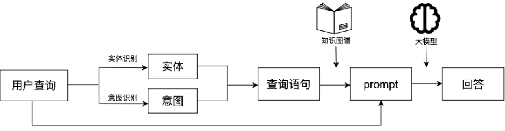

This project designs a medical Q&A system based on RAG (Retrieval-Augmented Generation) and large language model technology. It utilizes the DiseaseKG dataset with Neo4j to build a knowledge graph, combines BERT-based named entity recognition and 34B large model intent recognition, and improves system performance in medical consultation through precise knowledge retrieval and Q&A generation, addressing reliability issues in large model applications in the medical field.

RAG Technology:

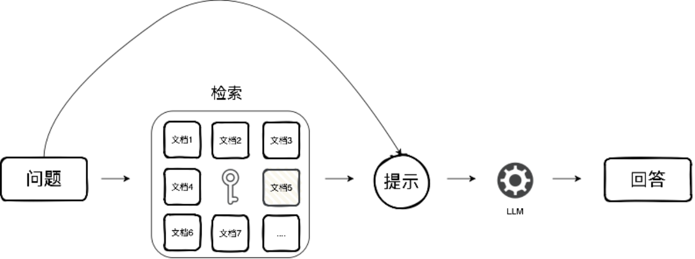

This project implements RAG using knowledge graphs. If you want to implement RAG technology using vector databases, please refer to [Langchain-Chatchat](https://github.com/chatchat-space/Langchain-Chatchat):


## Key Contributions

(1) Traditional RAG technology typically uses vector databases. Unlike traditional RAG implementations, this project adopts knowledge graphs, providing more precise external information for large models.

(2) This project constructs a medical domain knowledge graph and uses large language models to optimize entity information in the knowledge graph dataset files, making the constructed knowledge graph more accurate and scientific.

(3) This project builds a named entity recognition (NER) dataset through rule matching. Benefiting from the entity name optimization in (2), our model can easily achieve extremely high performance on the constructed dataset.

(4) This project proposes and implements three data augmentation strategies for entity recognition tasks: entity replacement, entity masking, and entity concatenation, improving RoBERTa model performance. On the test set, these data augmentation measures increased the RoBERTa model's F1 score from 96.77% to 97.40%.

(5) To avoid the manual cost of data annotation, this project directly designs prompts, combines context learning with chain-of-thought techniques, and uses large language models for intent recognition of user queries. This method ensures accuracy in the intent recognition process while reducing manual costs.

(6) This project uses the Streamlit framework to deploy the above models, achieving high encapsulation. Our interface covers registration and login, large language model selection, creating multiple chat windows, and other features.

## 🔥 To Do

- [x] Enhanced interface functionality (2024.5.21): Added login and registration interfaces (including user and admin identities), large model selection buttons (supporting Qwen and LLaMA), multi-window chat functionality, etc.
- [ ] NL2Cypher
- [ ] More optimizations...

## Python Environment Setup

Example setup:

```bash
git clone https://github.com/honeyandme/RAGQnASystem.git
cd RAGQnASystem
conda create -n RAGQnASystem python=3.10
conda activate RAGQnASystem
pip install -r requirements.txt
```

## Knowledge Graph Construction

First, you need to install Neo4j from the [official website](https://neo4j.com/deployment-center/#community). This project uses neo4j-community-5.18.1, which requires JDK 17.

After installing and running Neo4j, we need to create a knowledge graph based on the `data/medical_new_2.json` dataset.

```bash
python build_up_graph.py --website YourWebSite --user YourUserName --password YourPassWord --dbname YourDBName
```

Where:
- `--website`: Your Neo4j URL
- `--user`: Your database username
- `--password`: Your database password
- `--dbname`: Your database name

Example:

```bash
python build_up_graph.py --website http://localhost:7474 --user neo4j --password YourPassWord --dbname neo4j
```

After running `build_up_graph.py`, it will automatically create the `ent_aug` folder and `rel_aug.txt` file in the `data` folder, storing all entities and relationships respectively.

The following table shows key information from `medical_new_2.json`. For more detailed information, please click [here](https://github.com/nuolade/disease-kb):

### Knowledge Graph Entity Types (8 entity types):

| Entity Type | Chinese Meaning | Entity Count | Example |
|-------------|-----------------|--------------|---------|
| Disease     | Disease         | 8,808        | Acute pulmonary abscess |
| Drug        | Medicine        | 3,828        | Brinzolamide eye drops |
| Food        | Food            | 4,870        | Sesame |
| Check       | Examination     | 3,353        | Chest CT scan |
| Department  | Department      | 54           | Internal Medicine |
| Producer    | Available drugs | 17,201       | Qingyang dexamethasone acetate tablets |
| Symptom     | Disease symptoms| 5,998        | Fatigue |
| Cure        | Treatment methods| 544         | Antibiotic treatment |
| **Total**   | **Total**       | **44,656**   | **~44K entity scale** |

### Disease Entity Attribute Types (7 attribute types):

| Attribute Type | Chinese Meaning | Example |
|----------------|-----------------|---------|
| name          | Disease name    | Adult respiratory distress syndrome |
| desc          | Disease description | Adult respiratory distress syndrome, abbreviated as ARDS... |
| cause         | Disease cause   | Purulent infection can cause bacterial toxins... |
| prevent       | Prevention measures | High-risk patients should be closely monitored... |
| cure_lasttime | Treatment duration | 2-4 months |
| cured_prob    | Cure probability | 85% |
| easy_get      | Susceptible population | No specific population |

### Knowledge Graph Relationship Types (11 relationship types):

| Relationship Type | Chinese Meaning | Count | Example |
|-------------------|-----------------|-------|---------|
| belongs_to        | Belongs to      | 8,843 | <Internal Medicine, belongs_to, Respiratory Medicine> |
| common_drug       | Common drugs for disease | 14,647 | <ARDS, common_drug, Human albumin> |
| do_eat            | Recommended foods for disease | 22,230 | <ARDS, do_eat, Lotus seeds> |
| drugs_of          | Available drugs | 17,315 | <Human albumin, drugs_of, Laishi human albumin> |
| need_check        | Required examinations | 39,418 | <Unilateral emphysema, need_check, Bronchography> |
| no_eat            | Forbidden foods for disease | 22,239 | <ARDS, no_eat, Beer> |
| recommand_drug    | Recommended drugs | 59,465 | <Mixed hemorrhoids, recommand_drug, Jingwanhong hemorrhoid cream> |
| recommand_eat     | Recommended recipes | 40,221 | <ARDS, recommand_eat, Lily sugar porridge> |
| has_symptom       | Disease symptoms | 54,710 | <ARDS, has_symptom, Dyspnea> |
| acompany_with     | Comorbid diseases | 12,024 | <ARDS, acompany_with, Bacterial pneumonia> |
| cure_way          | Treatment methods | 21,047 | <Acute pulmonary abscess, cure_way, Antibiotic treatment> |
| **Total**         | **Total**        | **312,159** | **~310K relationship scale** |

The created knowledge graph is shown below (a sample retrieval result):

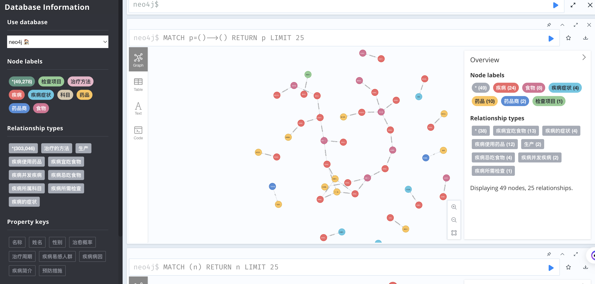

## Named Entity Recognition (NER)

What is NER?

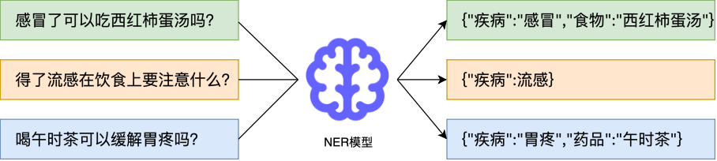

### Dataset Creation

You can run `ner_data.py`, which will create an NER dataset based on text from `data/medical_new_2.json` using rule matching techniques, saved in `data/ner_data_aug.txt`.

```bash
python ner_data.py # Optional to run
```

**Note 1**: We have already uploaded the `ner_data_aug.txt` file, so you can choose not to run `ner_data.py`.

**Note 2**: We use the BIO strategy for dataset annotation. The annotation results are shown below:

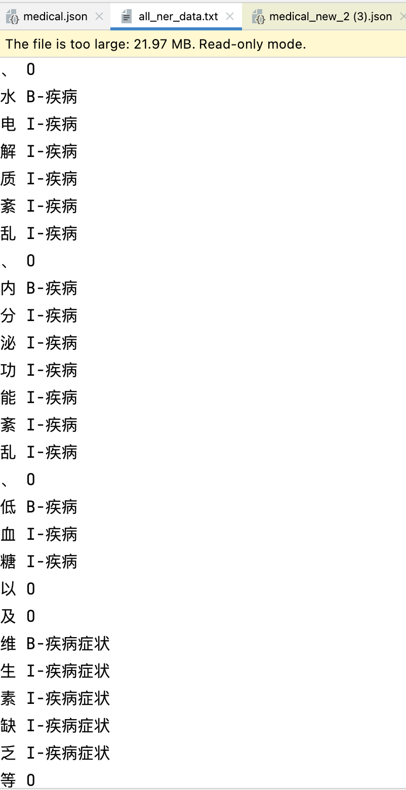

### Model Training

`ner_model.py` defines the NER model's network architecture and training approach. If you need to retrain a model, please download [chinese-roberta-wwm-ext](https://huggingface.co/hfl/chinese-roberta-wwm-ext) from Hugging Face and save it in the `model` folder, then run `ner_model.py`.

```bash
python ner_model.py # Optional to run
```

**Note 1**: If you don't want to train, you can [download](https://pan.baidu.com/s/1kwiNDyNjO2E2uO0oYmK8SA?pwd=08or) our pre-trained model and save it in the `model` folder without running the training code.

**Note 2**: Our NER model uses a simple BERT architecture.

```python
class Bert_Model(nn.Module):
    def __init__(self, model_name, hidden_size, tag_num, bi):
        super().__init__()
        self.bert = BertModel.from_pretrained(model_name)
        self.lstm = nn.LSTM(input_size=768, hidden_size=hidden_size, num_layers=2, batch_first=True, bidirectional=bi)
        if bi:
            self.classifier = nn.Linear(hidden_size*2, tag_num)
        else:
            self.classifier = nn.Linear(hidden_size, tag_num)
        self.loss_fn = nn.CrossEntropyLoss(ignore_index=0)

    def forward(self, x, label=None):
        bert_0, _ = self.bert(x, attention_mask=(x > 0), return_dict=False)
        gru_0, _ = self.lstm(bert_0)
        pre = self.classifier(gru_0)
        if label is not None:
            loss = self.loss_fn(pre.reshape(-1, pre.shape[-1]), label.reshape(-1))
            return loss
        else:
            return torch.argmax(pre, dim=-1).squeeze(0)
```

**Note 3**: We applied three data augmentation strategies during training: entity replacement, entity masking, and entity concatenation, improving model performance. Below are the F1 scores on the test set:

| Model Name                | Without Data Augmentation | With Data Augmentation |
|---------------------------|---------------------------|------------------------|
| bert-base-chinese         | 97.13%                    | 97.42%                 |
| chinese-roberta-wwm-ext   | 96.77%                    | 97.40%                 |

**Note 4**: To match the model's recognition results with entity names in the knowledge graph, we used TF-IDF entity alignment.

## Intent Recognition

What is intent recognition?

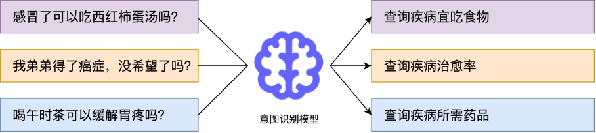

We compared three intent recognition strategies (rule matching, trained models, prompt engineering):

| Strategy        | Accuracy | Multi-intent Recognition | Manual Cost | Inference Speed | Resource Consumption |
|-----------------|----------|------------------------|--------------|-------------|---------------------|
| Rule Matching   | Low      | ✗                      | Low          | Fast        | Low                 |
| Trained Models  | High     | ✗                      | High (data annotation) | Medium | Medium |
| Prompt Engineering | High | ✓                      | Low          | Slow        | High                |

After comprehensive consideration, we adopted the prompt engineering approach: We categorized intents into 16 types, designed prompts for these 16 intent categories, and used large models to analyze user queries for intent.

**Note 1**: We combined context learning with chain-of-thought techniques, achieving good results.

**Note 2**: This code is integrated into `webui.py`, so you don't need to perform any operations.

## Knowledge Graph Query

We set up a query statement for each intent.

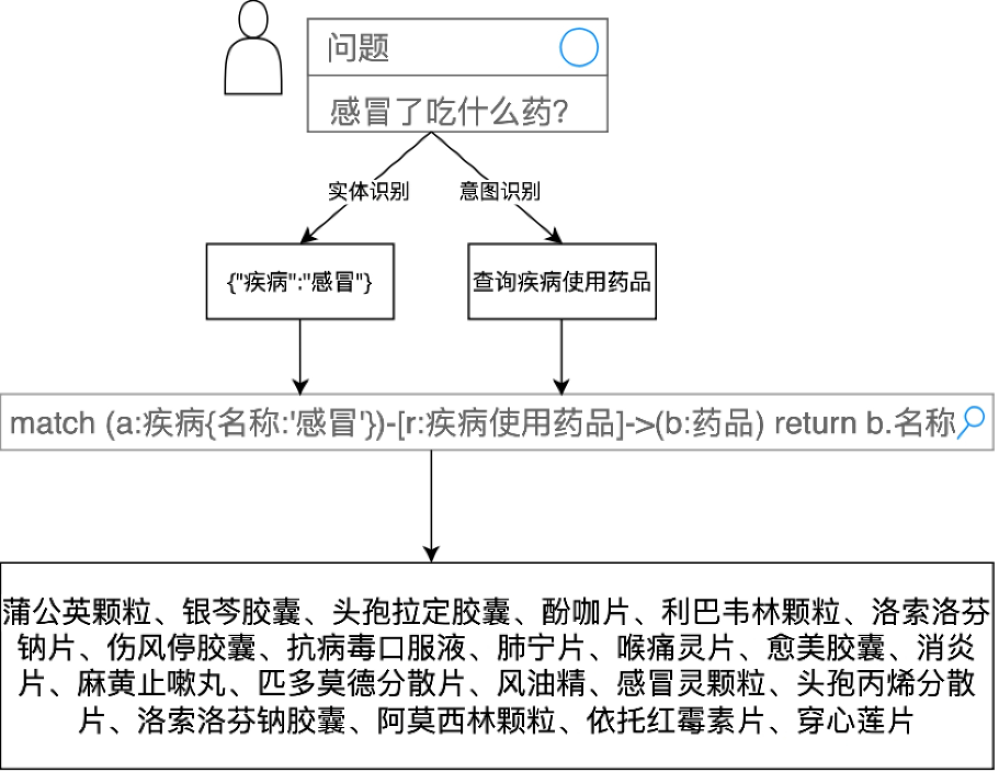

**Note**: This code is integrated into `webui.py`, so you don't need to perform any operations.

## Running the Interface

We integrated intent recognition, knowledge base query, and chat interface into `webui.py`. On 2024.5.21, we added login and registration interfaces, setting up user and admin identities. You can start it using:

```bash
streamlit run login.py
```

Login interface:

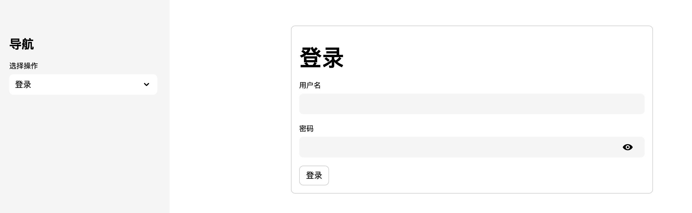

Registration interface:

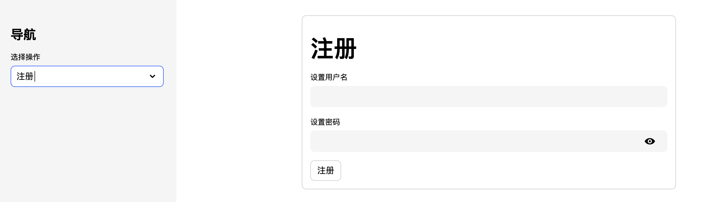

Admin login interface:

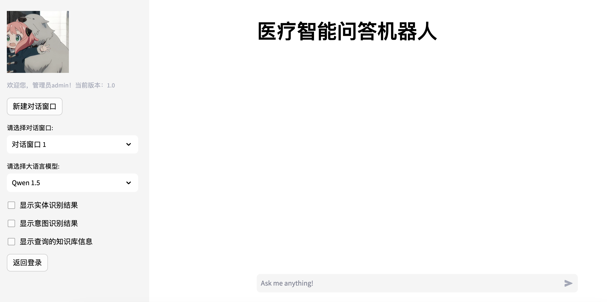

User login interface:

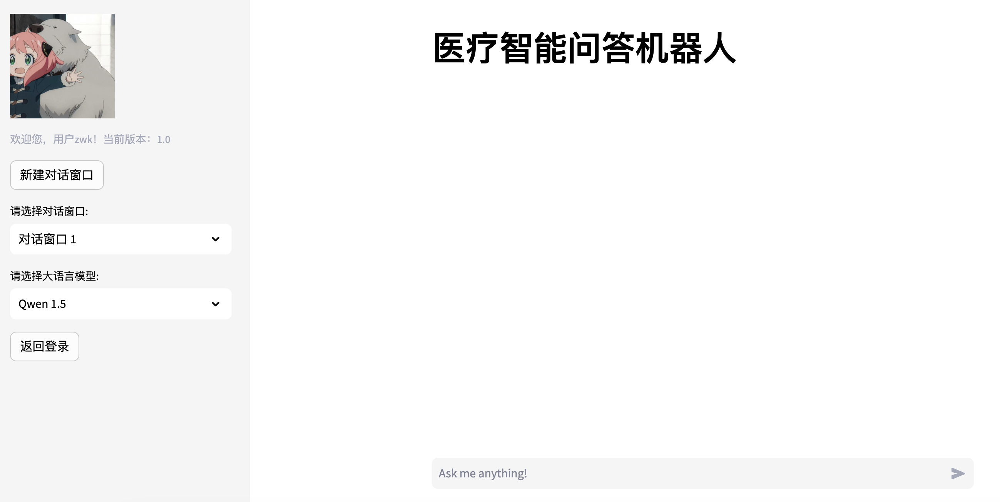

Some running examples:

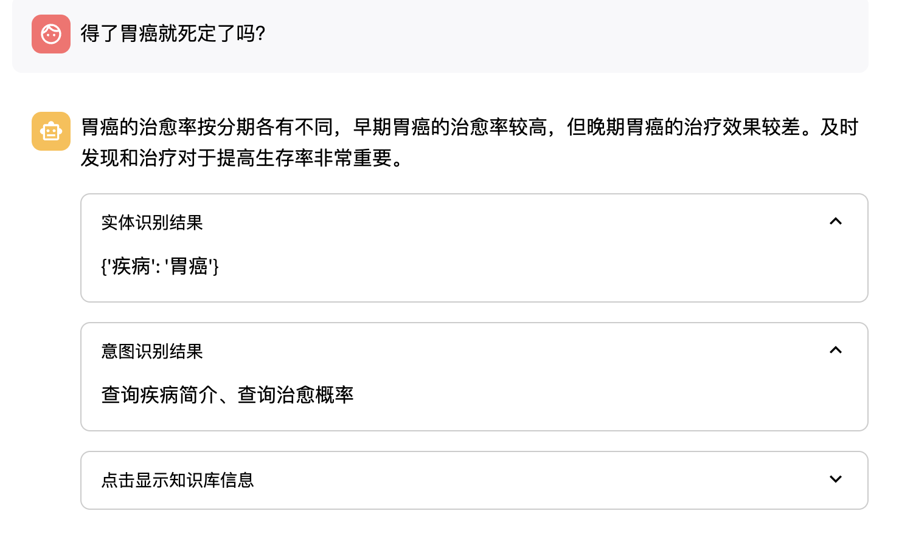

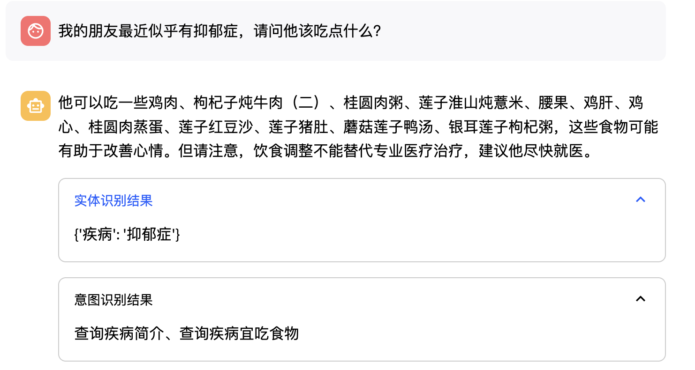

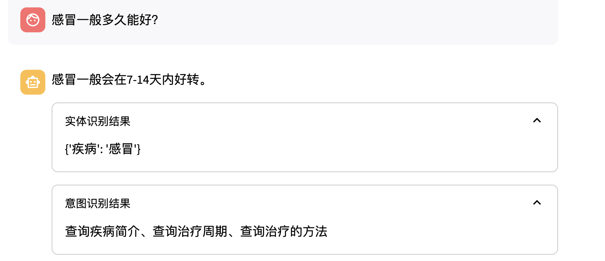

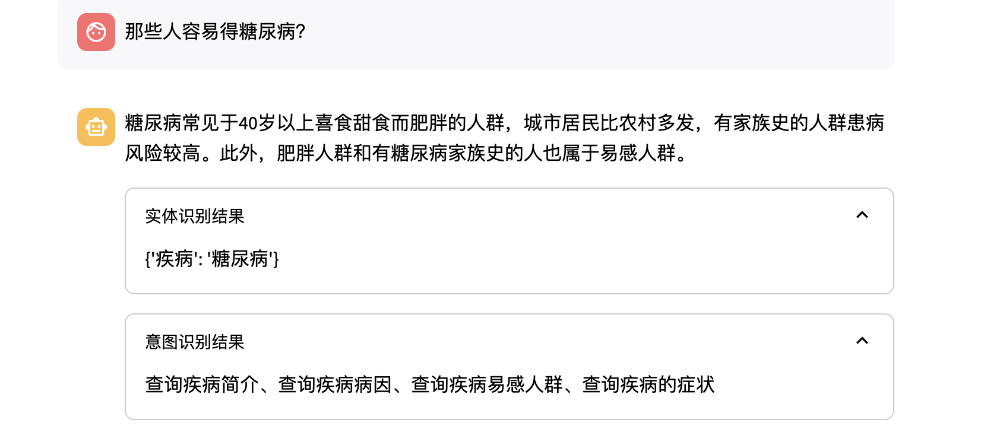

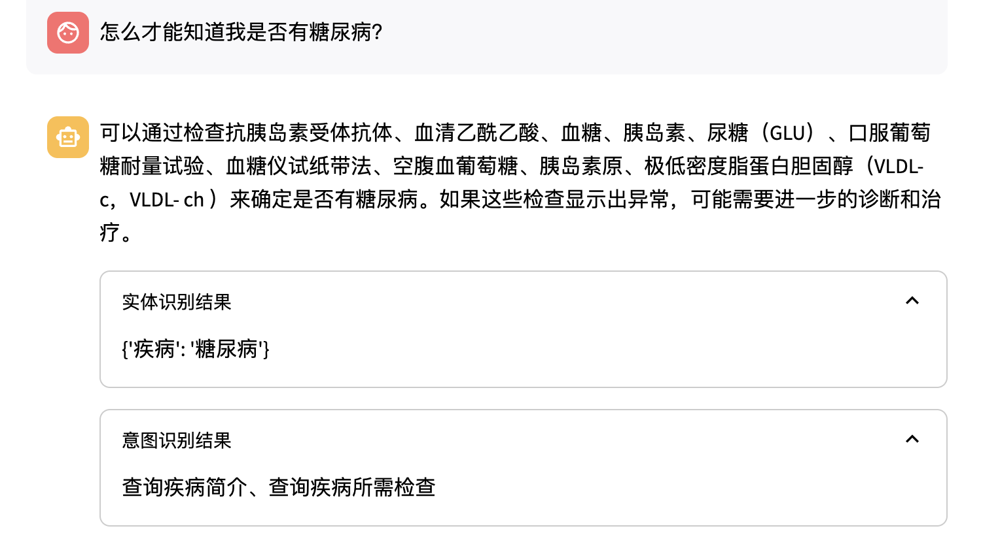

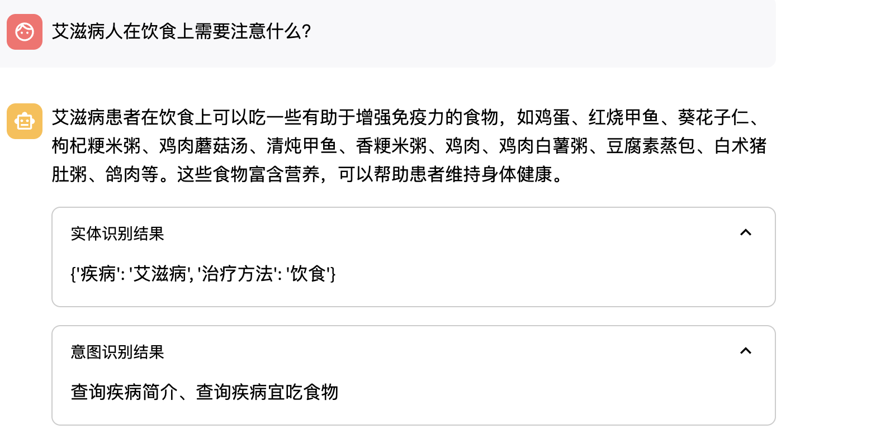

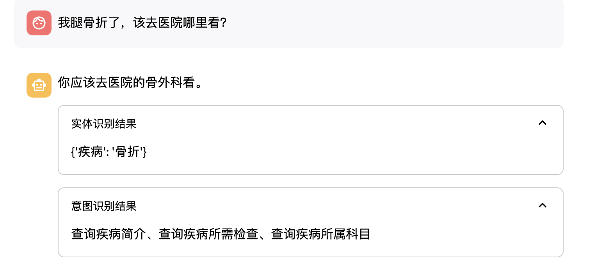

## Future Work

### NL2Cypher

We categorized intents into 16 types, which covers most intents but cannot exhaust all possibilities or fully utilize the knowledge graph data. Therefore, we are attempting NL2Cypher: abandoning entity recognition and intent recognition operations, directly generating query statements based on user questions.

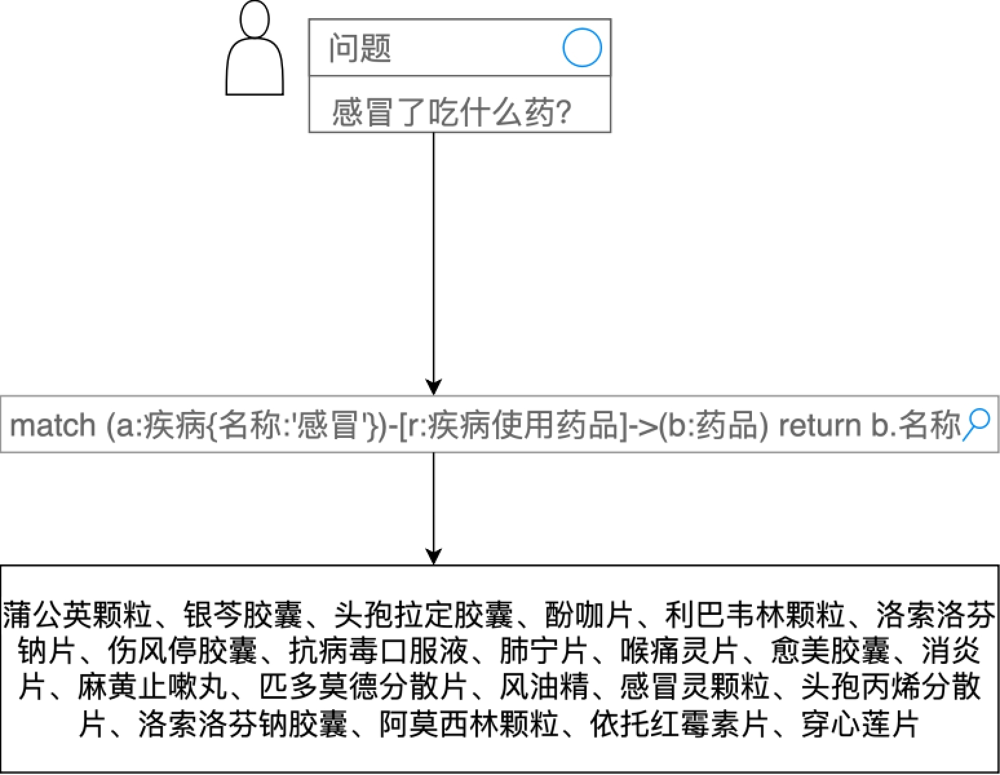

**Issue**: Requires manual data annotation.

## Contact

If you encounter difficulties during reproduction, please feel free to contact us!

Email: zeromakers@outlook.com
